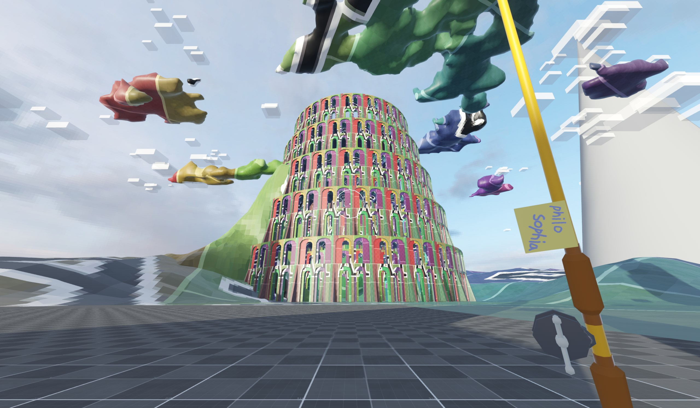
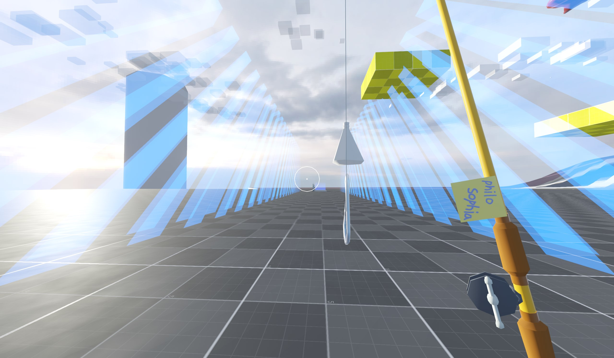
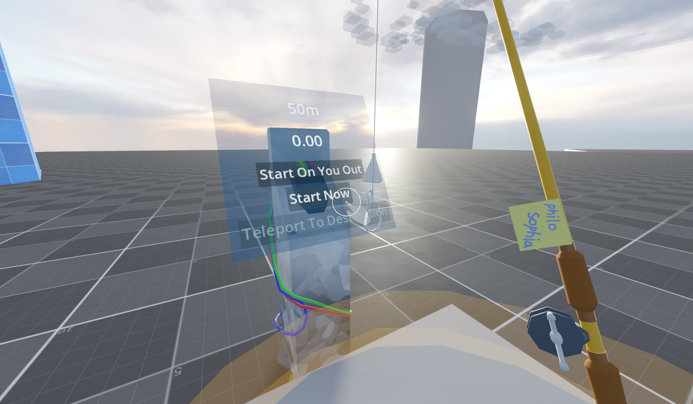
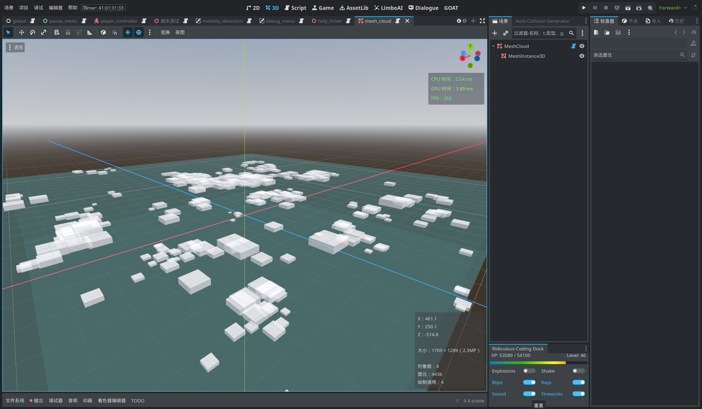
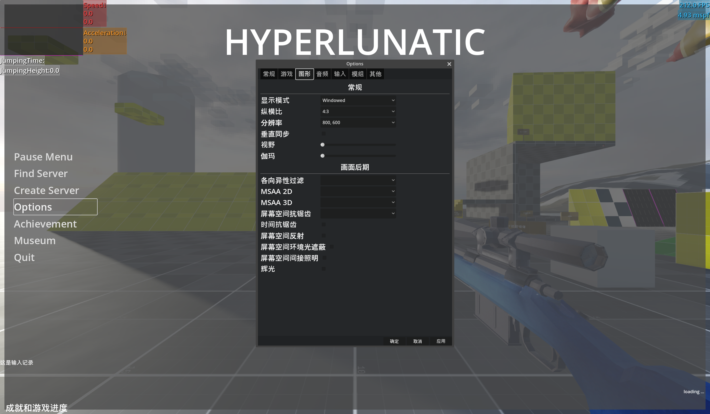

# HYPERLUNATIC

#### 📝说明：
HYPERLUNATIC 游戏项目备份存档开源学习文件和文件夹，由 白色蜂鸟(AlbedoHummingbird / 317gw) 制作，使用 Godot Engine 开发

#### 📦开始：
引擎版本会激进跟随最新稳定版 —— Godot_4.4-stable

现阶段导出游戏意义不大。请从上面 <>Code▽下载源码ZIP压缩包，自行下载安装 [Godot Engine](https://godotengine.org/)，并导入项目文件，然后自由发挥:)

所有设计都在施工中，看看概率论与统计，保不齐后续会发生什么

嘿！你现在就可以参与进来！地图设计 彩蛋 小游戏 ARG 之类……

#### 🪪介绍：
这是一款开源的\*头部视角\*3D游戏，包含 平台跳跃、冒险解谜、动作射击、弹幕躲避 等元素，你可以去地图中找找有什么是需要完成的。

> 或者去看看你身处的世界……

###### 🎦剧情
2077年，Karole Kate休假回到了老家。在整理老电脑的过程中，她发现以前玩的一款\*超级老\*的游戏的其中一个服务器还在线上。于是在一通硬件、软件、升级、整理、打MOD之后，她进入了这个——2000年便在计划的服务器。

###### 🗺地图设计
地球🌏 向 太阳☀️ 的宇宙之旅！或是 但丁的神曲？

使用区域来进行场景风格和玩法上的区分，区域内部采用线路关卡制，明确化 如空气墙、游玩区域、判定盒等场景构件。场景的背景模型是完整而且可以到达的。关卡和区域之间有不明显的连接，可以使用诸如掉出地图、寻找刻意的传送点等方式来完成切换。兼容主菜单列表选关。

###### 🛣游戏流程
除了完成关卡流程，还包含明确的带有规则限制的挑战任务。成就进度既是流程进度。与关卡、区域、挑战、成就交织在一起的解密。不必要的ARG(还未施工)。

###### 🖼画面
你可以看到你的身子！(未施工抱歉)

老服务器的房间，一种古老游戏进行现代视觉优化之后的氛围。采用低分辨率贴图，根据物体性质的选择性PBR材质，必要而简约的光照效果，特殊的着色器视效。

###### 玩法主要参考(推荐去试一下)
ULTRAKILL、
Celeste、
Mirror's Edge、
Garry's Mod、
Half-Life 2、
Neon White、
VOIN、
Touhou Project、
Minecraft、
Touhou Luna Nights、
沙雕之路、
Deadlock、
DEATH STRANDING DIRECTOR'S CUT、
Antimatter Dimensions、
NGU IDLE
…… 等好玩的游戏。

还有，以上构想均在制作中

PS: 风格灵感来自gmod和mc的服务器

#### 目前的进度 & 接下来要做的：
* 游戏系统：
  - [ ] 弹幕系统
  - [x] 起点终点
  - [ ] Buff系统
  - [ ] 受伤事件记录 用来代替玩家生命值
  - [ ] 成就系统
  - [ ] 关卡管理系统
  - [ ] 特效管理系统
  - [ ] 声效管理系统

* 游戏场景：
  - [x] 一个非常简单测试地图
  - [ ] 服务器大厅，包括家、教程和地图连接(仅地图风格名称，目前不涉及联机内容)
  - [ ] 一个能玩的高塔地图
  - [ ] 天空
  - [ ] 月球
  - [ ] 金星
  - [ ] 水星
  - [ ] 太阳
  - [ ] 地球

* 场景组件&交互：
  - [x] 玩家对其他物体的物理碰撞
  - [x] 康威生命游戏的地图模块
  - [x] 可以爆炸的油桶，根据伤害变化的爆炸效果
  - [x] 性能较差的浮力水
  - [x] 性能稍好的浮力水
  - [x] 冰面
  - [x] 根据表面应用摩擦力
  - [ ] 翻牌显示器
  - [ ] 蜡烛数量触发器 烛火是数字 红色是敌人 蓝色是场景组件破坏 归零触发门和机关
  - [ ] 门
  - [ ] 按钮
  - [ ] 压力板

* 视觉效果：
  - [x] 太阳
  - [x] 径向模糊
  - [ ] 优化水物理效果和性能
  - [ ] 进出水特效
  - [ ] 更好的水着色器
  - [ ] 脸上的吃水线
  - [ ] 添加玩家的手和脚

* 玩家动作：
  - [x] 基本的移动系统
  - [x] 奔跑
  - [x] 冲刺，冲刺跳
  - [x] 基于射线检测的边缘攀爬系统
  - [x] 磕头加速跳
  - [x] 低速模式与静步
  - [x] V键飞行
  - [ ] 起源引擎的旋转跳和滑翔
  - [ ] 凌波微步
  - [ ] 调整跳跃、跑步等数值
  - [ ] 跳墙
  - [x] 站在敌人头顶、弹幕上
  - [ ] 飞踢
  - [ ] 优化边缘静步不掉落判断

* 武器：
  - [x] 简单的射击实现
  - [x] 武器切换
  - [x] 自瞄
  - [x] 简单的步枪
  - [x] 钓鱼竿  #mc同款
  - [ ] 圣水钓竿  #打死鬼魂
  - [ ] MTs-3 Rekord  #无后座高精度手枪
  - [ ] 重炮狙击枪 Rifle  #子弹弹射，超级大狙，猎象枪
  - [ ] 片短剑  #插墙上可以站着
  - [ ] 棒球棍  #弹反，打飞任何东西
  - [ ] 小镰刀  #并非
  - [ ] 手  #手
  - [ ] 管理员之枪  #红色沙漠之鹰

* NPC & 敌人：
  - [x] 飞鱼  #基于鱼群模拟 Flying Fish
  - [ ] 鬼魂  #附身到特定物体 Ghost
  - [ ] 障目天使雕像  #视线内可移动并无敌，视线外相反 Blind Angel Statue
  - [ ] 以鸟飞行的弓手  #魔王的箭雨 Archer who Flies with Birds
  - [ ] 鹿颈长  #柱形搭路机 Effarig
  - [ ] 太阳马  #一个向导 Sun Mare
  - [ ] 拿花妖精  #Invoke Flower Yousei

* UI：
  - [ ] 游戏主菜单
  - [x] 暂停菜单
  - [ ] gmod的C键调出可鼠标操作的ui
  - [ ] 显示RigidBody3D信息的ui
  - [ ] mc的对话窗口
  - [ ] 起源引擎的对话与提示信息字幕
  - [ ] 起源和gmod的提示气泡
  - [ ] mc的声音文字提示

* 生活质量：
  - [ ] 修bug
  - [x] F3 Debug菜单
  - [x] panku_console 的Debug命令行+菜单

* 杂项：
  - [ ] 完善Github仓库，添加更多的说明和信息。

#### Q&A：
* 为什么选择使用Godot开发3D游戏？
  * Godot本身足够轻量级，磁盘、内存占用低，软件开关迅速，电脑负担小，开发方便。其他引擎的高新技术尚不考虑。

* 参与开发可以干什么？
  * 很多方式，比如提交代码、报告Bug、提供建议、翻译文档等。

* 我想提供帮助？
  * 你可以使用这个Github仓库，或在下方↓的联系方式留言讨论。

* 多语言支持？
  * 简体中文、繁体中文、英文。目前没有实力支持其他语言。如你想制作其他语言翻译，我非常乐意，直接联系我。

* 登录平台？
  * 仅目前，PC端，Steam、itch.io

* 要开发多久？
  * 我想要全职开发，但是会有困难，总之comeing s∞n in 2077

* 为什么是2077？
  * 因为好多赛博朋克或者未来风格作品都有出现这个年份。

* 游戏玩法是啥啊？缝合这么多游戏？
  * 主要玩法参考Celeste的平台跳跃，ULTRAKILL的快节奏操作，地图设计参考Celeste、Neon White。感觉和印象是更重要的，实际上并没有搭配毫不相干的游戏机制。
  * 四处逛逛。

* 我好像没看到有什么角色？
  * 游戏流程以玩家为中心，故事性较弱，大概会有我小说、车卡、RimWorld中的角色，且大概都是女的，因为Touhou Project。

* Antimatter Dimensions和NGU IDLE是挂机、点击、idle游戏，和这游戏有啥关系？
  * 这俩游戏的流程设计非常好，其中的一些解谜部分非常有趣，所以偷了。

* ？：
  * 答应我，好好睡觉。

#### 注意事项：
本项目为开源项目，欢迎参与贡献，但请遵守以下规定：
1. 请不要删除或修改文件中的版权声明。
2. 请不要在项目中使用任何未经授权的素材或代码。
3. 请在参与贡献时，遵循开源协议的规定。
4. 用于商业用途时，仅代码可用 遵守GPL-3.0许可证；不要使用 美术/声效/模型/文本 等资源；不要使用 HYPERLUNATIC/FireKami/白色蜂鸟/AlbedoHummingbird/317gw 等字样用于宣传或主要内容(包括其大小写形式)。

项目根目录下，目前只有assets文件夹能确保为项目作者制作的主要原创部分。
assets文件夹下的部分代码和资源文件、图像、音频来自网络，对其进行了修改，遵守其协议，并尽可能的表明了出处，如发现问题请联系项目作者。
目前并未整理非代码资源的许可，请不要擅自使用。

根目录下的其他并非由Godot Engine或其addon生成文件和文件夹，为临时的流动文件，其来源为其他开源项目或互联网，用于测试、开发等。

addons文件夹下存放着Godot Engine的插件。
插件的原作者并非项目作者，部分代码已根据项目需求进行了修改，遵守其协议，因嫌麻烦并未列出许可证，如有问题请联系项目作者。

如有对其他开源项目、addon、互联网资源的使用许可或许可证的异议，为项目作者的疏忽，请联系项目作者。

> 作者邮箱：<wo3178216379@outlook.com>
> INDIENOVA主页 -> [HYPERLUNATIC](https://indienova.com/g/hyperlunatic)
> itch.io主页 -> [HYPERLUNATIC](https://albedohummingbird.itch.io/hyperlunatic)
> QQ讨论群 -> [白色蜂鸟&FireKami讨论](https://qm.qq.com/q/zh3svlXTBm) 705304831
> Discord聊天室 -> [FireKami Game&Fiction](https://discord.gg/c9v67xuuQR)
> /tp [github开源地址](https://github.com/317gw/HYPERLUNATIC)

> 现实的荒野

---