# HYPERLUNATIC

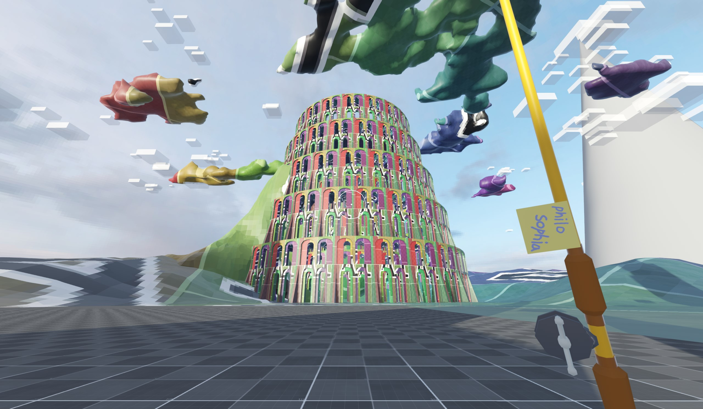

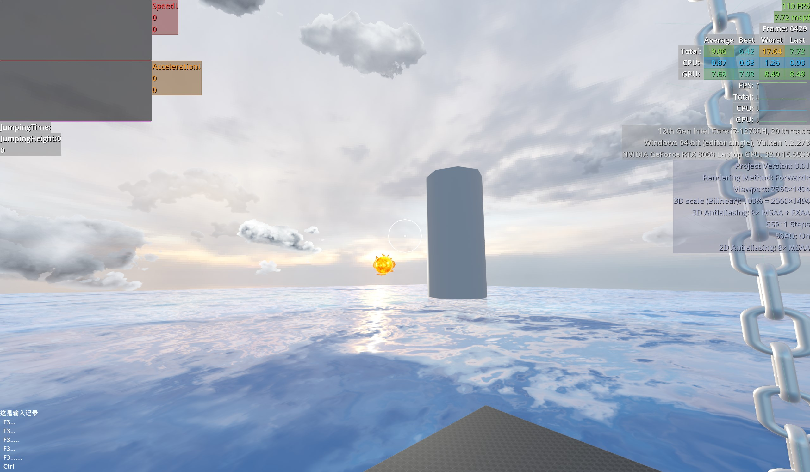
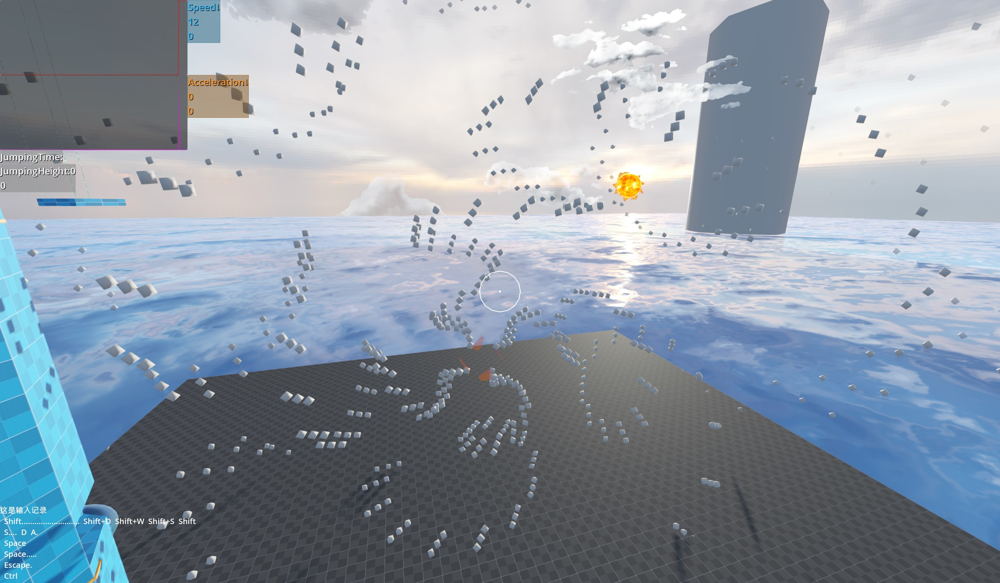
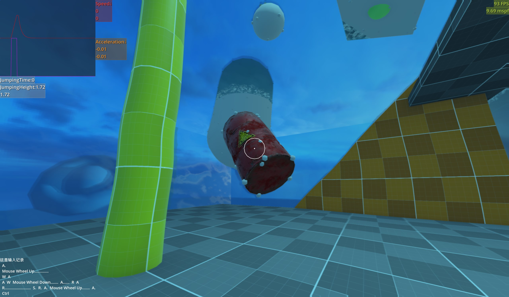

#### 📝Description:
*The text is translated by ai
Head person parkour exploration bullet-hell game, by White Hummingbird, Godot Engine Development
HYPERLUNATIC is a backup archive and open-source learning project for the game, created by AlbedoHummingbird (317gw) and developed using the Godot Engine.

#### 📦Getting Started:
The engine version will aggressively follow the latest stable release — Godot_4.4-stable.

At this stage, exporting the game is not meaningful. Please download the source code ZIP from the green `< >Code▽` button above, install [Godot Engine](https://godotengine.org/), import the project files, and then go wild :)

All designs are under construction. Check out probability and statistics—who knows what might happen next.

Hey! You can join in right now! Map design, easter eggs, mini-games, ARGs, etc.

#### 🪪Introduction:
This is an open-source *first-person* 3D game featuring platform jumping, adventure puzzles, action shooting, bullet hell dodging, and more. Explore the map to find out what needs to be done.

> Or take a look at the world around you...

###### 🎦Story:
In 2077, Karole Kate returns to her hometown for vacation. While sorting through an old computer, she discovers that one of the servers for a *super old* game she used to play is still online. After some hardware and software upgrades, modifications, and tweaks, she enters this server—originally planned in the year 2000.

###### 🗺Map Design:
A cosmic journey from Earth 🌏 to the Sun ☀️! Or perhaps Dante's Divine Comedy?

Regions are used to differentiate scene styles and gameplay mechanics. Internally, regions adopt a linear level design with clear boundaries, such as invisible walls, playable areas, and collision boxes. The background models in scenes are complete and accessible. Levels and regions are connected in subtle ways, allowing transitions by falling off the map or finding intentional teleport points. Compatible with a main menu level selection system.

###### 🛣Gameplay Flow:
In addition to completing level objectives, the game includes challenge tasks with specific rule restrictions. Achievement progress reflects gameplay progress. Puzzles are intertwined with levels, regions, challenges, and achievements. Optional ARG elements (not yet implemented).

###### 🖼Visuals:
You can see your own body! (Not implemented yet, sorry.)

The old server's rooms evoke the atmosphere of an ancient game with modern visual enhancements. Features low-resolution textures, selective PBR materials based on object properties, essential and minimalist lighting effects, and special shader visuals.

###### Main Gameplay References (Recommended to Try):
ULTRAKILL,  
Celeste,  
Mirror's Edge,  
Garry's Mod,  
Half-Life 2,  
Neon White,  
VOIN,  
Touhou Project,  
Minecraft,  
Touhou Luna Nights,  
The Path of Pain,  
Deadlock,  
DEATH STRANDING DIRECTOR'S CUT,  
Antimatter Dimensions,  
NGU IDLE  
... and other fun games.

Also, all the above ideas are still in development.

PS: Stylistic inspiration comes from gmod and Minecraft servers.

#### Current Progress & Next Steps:
* Game Systems:
  - [ ] Bullet Hell System
  - [x] Start and End Points
  - [ ] Buff System
  - [ ] Damage Event Logging (Replaces Player Health)
  - [ ] Achievement System
  - [ ] Level Management System
  - [ ] Special Effects Management System
  - [ ] Sound Effects Management System

* Game Scenes:
  - [x] A Very Simple Test Map
  - [ ] Server Lobby (Includes Home, Tutorial, and Map Connections)
  - [ ] A Playable Tower Map
  - [ ] Sky
  - [ ] Moon
  - [ ] Venus
  - [ ] Mercury
  - [ ] Sun
  - [ ] Earth

* Scene Components & Interactions:
  - [x] Player Physics Collision with Objects
  - [x] Conway's Game of Life Map Module
  - [x] Explosive Barrels with Damage-Based Effects
  - [x] Low-Performance Buoyant Water
  - [x] Better-Performance Buoyant Water
  - [x] Ice Surfaces
  - [x] Surface-Specific Friction
  - [ ] Flip-Display Panel
  - [ ] Candle Count Trigger (Candles Represent Numbers, Red for Enemies, Blue for Scene Destruction, Zero Triggers Doors/Mechanics)
  - [ ] Doors
  - [ ] Buttons
  - [ ] Pressure Plates

* Visual Effects:
  - [x] Sun
  - [x] Radial Blur
  - [ ] Optimize Water Physics and Performance
  - [ ] Water Entry/Exit Effects
  - [ ] Better Water Shader
  - [ ] Waterline on the Face
  - [ ] Add Player's Hands and Feet

* Player Actions:
  - [x] Basic Movement System
  - [x] Running
  - [x] Dashing and Dash-Jumping
  - [x] Raycast-Based Edge Climbing System
  - [x] Headbang Boost Jump
  - [x] Slow Mode and Stealth Walking
  - [x] V-Key Flight
  - [ ] Source Engine-Style Bunny Hopping and Gliding
  - [ ] Lightfoot Steps
  - [ ] Tweak Jumping, Running, etc.
  - [ ] Wall Jumping
  - [x] Standing on Enemies or Bullets
  - [ ] Flying Kick
  - [ ] Improve Edge Stealth No-Fall Detection

* Weapons:
  - [x] Basic Shooting Implementation
  - [x] Weapon Switching
  - [x] Auto-Aim
  - [x] Simple Rifle
  - [x] Fishing Rod (Minecraft-Style)
  - [ ] Holy Water Fishing Rod (Kills Ghosts)
  - [ ] MTs-3 Rekord (No-Recoil High-Precision Pistol)
  - [ ] Heavy Sniper Rifle (Ricochet Bullets, Elephant Gun)
  - [ ] Short Blade (Can Stick to Walls for Standing)
  - [ ] Baseball Bat (Deflects and Launches Anything)
  - [ ] Small Sickle (Not Really)
  - [ ] Hand (Just a Hand)
  - [ ] Admin Gun (Red Desert Eagle)

* NPCs & Enemies:
  - [x] Flying Fish (Based on Fish Swarm Simulation)
  - [ ] Ghosts (Possess Specific Objects)
  - [ ] Blind Angel Statues (Invincible and Mobile in Sight, Vulnerable Out of Sight)
  - [ ] Archer Who Flies with Birds (Arrow Rain Attacks)
  - [ ] Effarig (Pillar-Building Machine)
  - [ ] Sun Mare (A Guide)
  - [ ] Flower Fairy (Invokes Flowers)

* UI:
  - [ ] Main Game Menu
  - [x] Pause Menu
  - [ ] Gmod-Style C-Key UI with Mouse Control
  - [ ] UI Displaying RigidBody3D Information
  - [ ] Minecraft-Style Dialogue Window
  - [ ] Source Engine-Style Dialogue and Hint Subtitles
  - [ ] Source and Gmod-Style Hint Bubbles
  - [ ] Minecraft-Style Sound Text Hints

* Quality of Life:
  - [ ] Fix Bugs
  - [x] F3 Debug Menu
  - [x] panku_console Debug Command Line + Menu

* Miscellaneous:
  - [ ] Improve GitHub Repository (Add More Descriptions and Information).

#### Q&A:
* Why Use Godot for 3D Game Development?
  * Godot is lightweight, with low disk and memory usage, fast startup, and minimal system burden, making development easier. Other engines' advanced technologies are not yet considered.

* How Can I Contribute?
  * Many ways: submit code, report bugs, suggest ideas, translate docs, etc.

* I Want to Help!
  * Use this GitHub repo or leave a message via the contact info below ↓.

* Multilingual Support?
  * Simplified Chinese, Traditional Chinese, English. No capacity for other languages yet. If you'd like to contribute translations, contact me.

* Platforms?
  * Currently, PC only (Steam, itch.io).

* How Long Will Development Take?
  * I'd like to develop full-time, but it's challenging. Coming s∞n in 2077.

* Why 2077?
  * Because many cyberpunk or futuristic works reference this year.

* What's the Gameplay? A Frankenstein of Games?
  * Mainly inspired by Celeste's platforming and ULTRAKILL's fast-paced action. Map design draws from Celeste and Neon White. Feel and impression matter more—no mismatched mechanics.
  * Just explore.

* Where Are the Characters?
  * The game focuses on the player, with minimal story. Might include characters from my novels, RimWorld, etc., likely female (because Touhou Project).

* Antimatter Dimensions and NGU IDLE are idle games—how are they related?
  * Their progression design is excellent, and some puzzles are fun, so I borrowed ideas.

* ?:
  * Promise me you'll sleep well.

#### Notes:
This is an open-source project. Contributions are welcome, but please follow these rules:
1. Do not remove or modify copyright notices in files.
2. Do not use unauthorized assets or code.
3. Follow open-source license terms when contributing.
4. For commercial use, only the code is available under GPL-3.0. Do not use art/sound/models/text resources or the names HYPERLUNATIC/FireKami/AlbedoHummingbird/317gw (in any case) for promotion.

Only the `assets` folder in the root directory is confirmed as original work by the author. Some code, resources, images, and audio in `assets` are modified from online sources, credited where possible. Report issues if found.

Other non-Godot-generated files/folders are temporary or for testing/development.

The `addons` folder contains Godot Engine plugins. Plugins are not authored by the project creator; some code is modified per project needs. Licenses are not listed for simplicity—contact the author for issues.

For concerns about open-source projects, addons, or online resources, contact the author.

> Email: <wo3178216379@outlook.com>  
> INDIENOVA Page -> [HYPERLUNATIC](https://indienova.com/g/hyperlunatic)  
> itch.io Page -> [HYPERLUNATIC](https://albedohummingbird.itch.io/hyperlunatic)  
> bilibili -> [AlbedoHummingbird's Space](https://space.bilibili.com/32704272)  
> QQ Group -> [AlbedoHummingbird & FireKami Discussion](https://qm.qq.com/q/zh3svlXTBm) 705304831  
> Discord -> [FireKami Game&Fiction](https://discord.gg/c9v67xuuQR)  
> /tp [GitHub Repo](https://github.com/317gw/HYPERLUNATIC)  

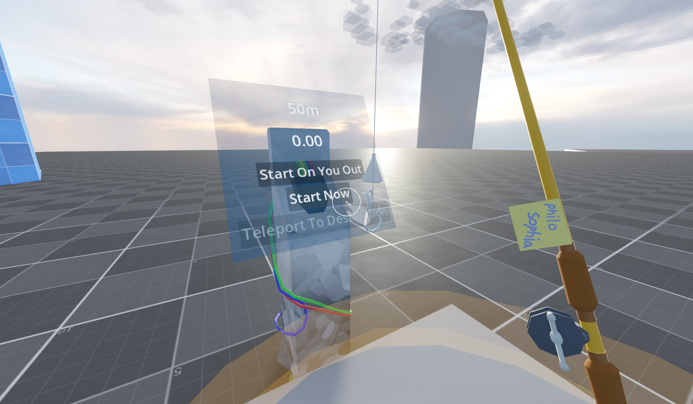  
  
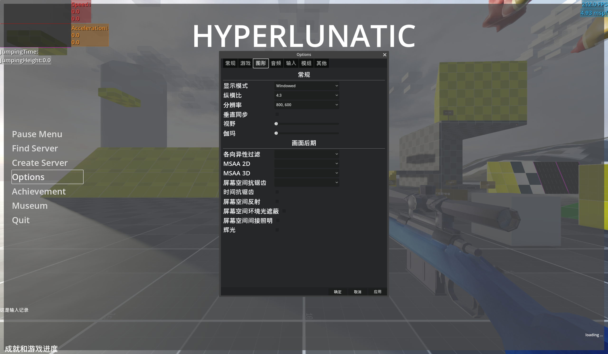  
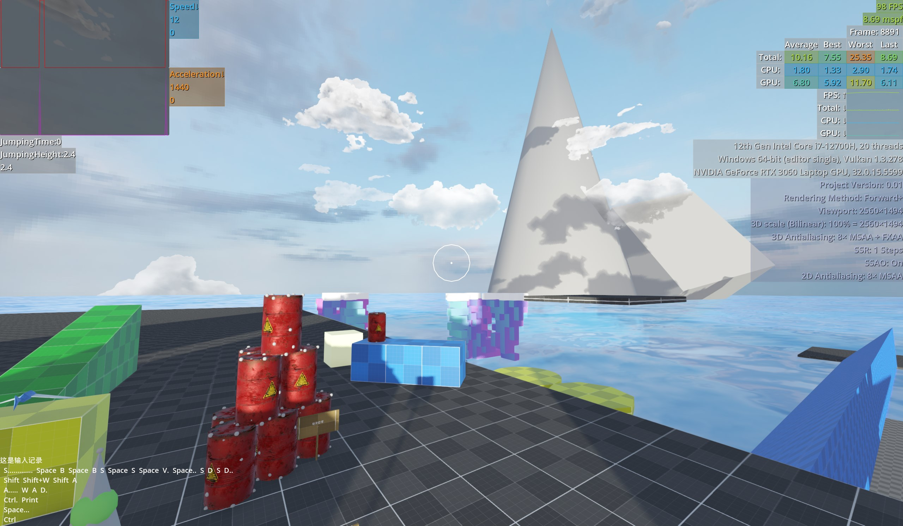  
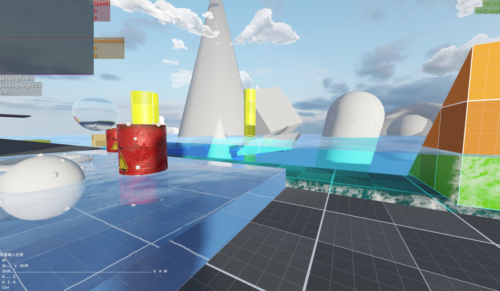  
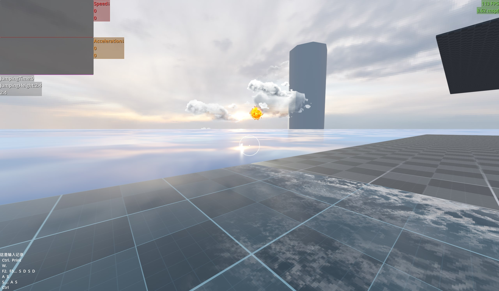  
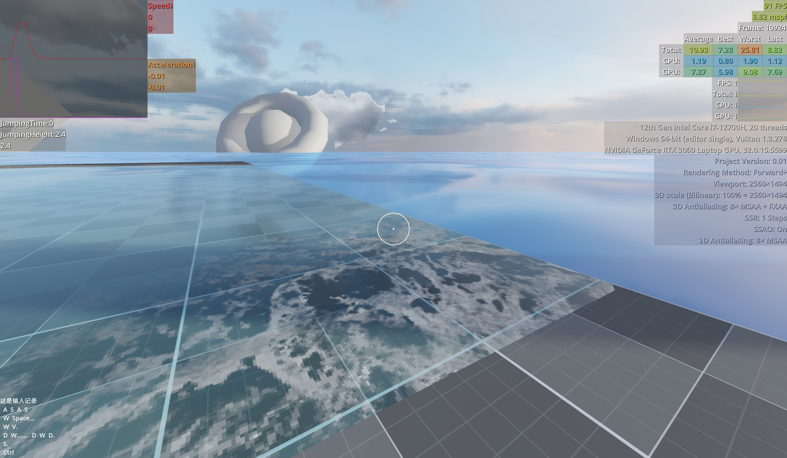  
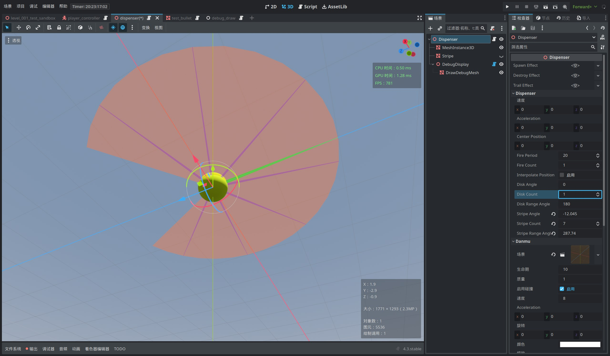  
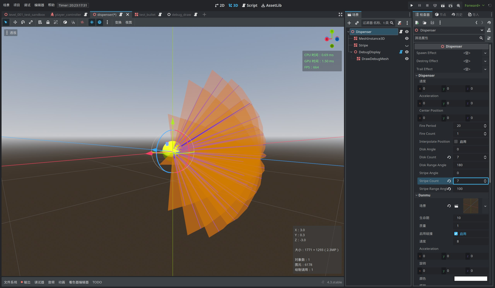  
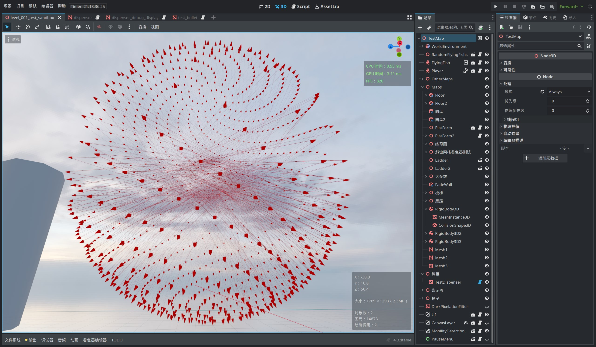  
  

> The Wilderness of Reality  

---